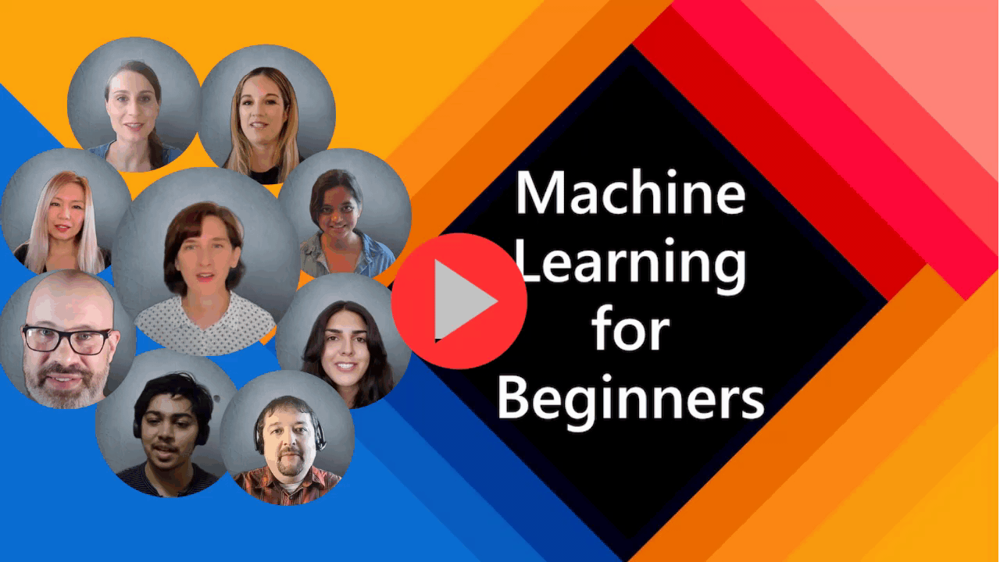

# 🧠 Machine Learning - Learn Mind

An interactive, beautifully designed **Machine Learning curriculum** built with Next.js. Learn ML concepts from foundations to deep learning with visual explanations, math formulas, and Python code examples.



## ✨ Features

- 📚 **38 comprehensive lessons** covering all ML fundamentals
- 🎨 **Warm, study-friendly theme** with cozy aesthetics
- 📐 **Mathematical rigor** with clean formula presentation
- 🐍 **Python code examples** using scikit-learn, PyTorch, NumPy
- 📊 **Visual explanations** and intuitive diagrams
- 📱 **Fully responsive** design

## 📖 Curriculum

### Unit I: Foundations & Regression
- ML Overview & Learning Paradigms
- Linear & Logistic Regression
- Polynomial Regression
- Generalized Linear Models (GLMs)
- Multi-class Classification (Softmax)

### Unit II: Classification
- K-Nearest Neighbors (KNN)
- Decision Trees & Random Forests
- Support Vector Machines (SVM)
- Naive Bayes (with Laplace Smoothing)
- Gaussian Discriminant Analysis (GDA)
- Kernel Methods

### Unit III: Clustering & Evaluation
- K-Means Clustering
- Gaussian Mixture Models (GMM)
- PCA & Dimensionality Reduction
- Factor Analysis
- Bias-Variance Tradeoff
- Cross-Validation & Metrics

### Unit IV: Optimization & Deep Learning
- Loss Functions
- Gradient Descent Variants
- Backpropagation
- Neural Networks
- Introduction to Deep Learning

### Unit V: Ethics
- Bias in Machine Learning
- Data Collection Ethics
- Explainable AI (XAI)

### Extras
- NLP: Tokenization, TF-IDF, Sentiment Analysis
- Time Series: Basics, ARIMA Models

## 🚀 Getting Started

```bash
# Clone the repository
git clone https://github.com/aman67032/Machine-Learning-Learn-Mind.git

# Navigate to project
cd Machine-Learning-Learn-Mind

# Install dependencies
npm install

# Run development server
npm run dev
```

Open [http://localhost:3000](http://localhost:3000) to view the app.

## 🛠️ Tech Stack

- **Framework:** Next.js 14 (App Router)
- **Styling:** CSS with custom design system
- **Icons:** Lucide React
- **Fonts:** Custom serif + sans-serif typography

## 📁 Project Structure

```
ml_web/
├── app/
│   ├── learn/           # All learning pages
│   │   ├── foundations/ # Math, Python, Overview
│   │   ├── regression/  # Linear, Logistic, GLM
│   │   ├── classification/ # KNN, Trees, SVM, NB
│   │   ├── clustering/  # K-Means, GMM, PCA
│   │   ├── evaluation/  # Metrics, CV, Splitting
│   │   ├── optimization/# Loss, GD, Neural Nets
│   │   ├── nlp/         # Tokenization, TF-IDF
│   │   ├── timeseries/  # ARIMA, Basics
│   │   └── ethics/      # Bias, XAI
│   ├── page.tsx         # Home page
│   └── globals.css      # Global styles
├── public/
│   ├── images/          # Sketchnotes & visuals
│   └── pdf/             # Reference materials
└── README.md
```

## 📸 Screenshots

| Home Page | Learning Path |
|-----------|---------------|
| Warm, inviting landing | Organized curriculum |

## 🎓 Based On

- Stanford CS229 Machine Learning course notes
- ML for Beginners curriculum concepts

## 📄 License

MIT License - feel free to use for learning!

---

Made with ❤️ for ML learners everywhere
